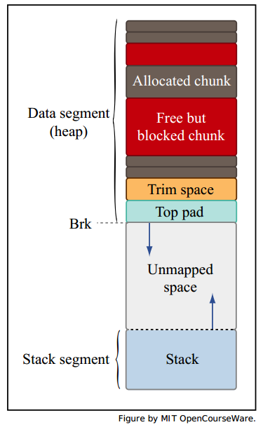

Memory management
=================

This is some notes from the MIT online course [Introduction to C Memory Management and C++ Object-Oriented Programming](http://ocw.mit.edu/courses/electrical-engineering-and-computer-science/6-088-introduction-to-c-memory-management-and-c-object-oriented-programming-january-iap-2010/).

## stack vs. heap

* The C compiler lays out memory corresponding to functions (arguments, variables) on the *stack*.
* C allows the programmer to allocate additional memory on the *heap*.

     |stack|heap
 ----|----------|-------
 Memory is allocated | Upon entering function | With `malloc`
 Memory is deallocated | Upon function return | with `free`
 Addresses are assigned | Statically | Dynamically
 
 
 
 The `malloc()` function still exists in C++, but it's better to use `new`. The main advantage of of `new` over `malloc()` is that `new` doesn't just allocate the appropriate size of memory, it constructs objects. The `malloc()` function only sets aside a piece of memory of a certain size. (ref. [The Professional C++][1], P762)
 
 
## Reference
 
[1]: "The Professional C++, Marc Gregoire, Nicholas A. Solter, Scott J. Kepler. Second Edition."